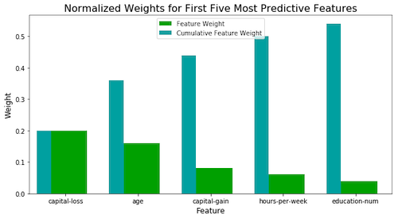
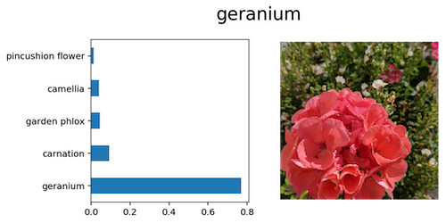

## Udacity Data Scientist Nano Degree

Keeping a working folder for projects of [Udacity's Data Scientist Nano Degree program](https://de.udacity.com/course/data-scientist-nanodegree--nd025). So far completed:

1. **Supervised Learning Project** - This project tackles predicting likely donors based on demographic features for the fictitious CharityML organization. Includes a short section for feature exploration, fits multiple candidate models (Random Forest Classifier, Decision Tree, Support Vector Machine, and AdaBoost) and picks the final model based on its f-score before optimizing via GridSearch and making final predictions.

2. **Deep Learning Project** - This Jupyter notebook illustrates the process of using deep neural networks and transfer learning to classify images of flowers. The project uses [PyTorch's ResNet152](https://pytorch.org/docs/stable/_modules/torchvision/models/resnet.html#resnet18) and Oxford University's [102 Category Flower Dataset](http://www.robots.ox.ac.uk/~vgg/data/flowers/102/index.html) to achieve a 92% accuracy on the test set. The user can upload new images and get classification results through a command line interface.

3. **Unsupervised Learning Projects** - In this notebook unsupervised learning techniques are used on demographic and spending data to create distinct customer segments. The data and design for this project were provided by Arvato Financial Services. The project is divided in three steps:

	 1. Preprocessing the data including feature generation and missing value handling
	 2. Applying dimensionality reduction techniques for better performance
	 3. Implementing clustering algorithms to segment customers with the goal of optimizing customer outreach for a mail order company.

4. **Disaster Response Pipeline Project** - This project creates a web app to aid disaster relief workers. It provides the user with an interface to input text messages and returns up to 36 different labels as they apply to the message content. Under the hood the web app is using a random forest algorithm that achieved 97% precision and 85% recall on the testing dataset (that said, performance varies a lot by label category). The web app also displays visualizations of the training data used to train the algorithm. Scripts to load, clean, and save the input data and retrain the classifier are also included in this folder. The dataset has been provided by FigureEight.

