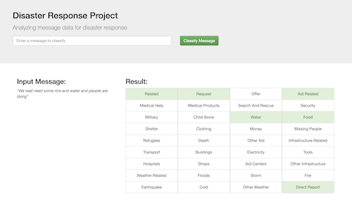

# Disaster Response Pipeline

### About this project:
This project creates a web app to aid disaster relief workers. It provides the user with an interface to input text messages and returns up to 36 different labels as they apply to the message content. Under the hood the web app is using a random forest algorithm that achieved 97% precision and 85% recall on the testing dataset (that said, performance varies a lot by label category). The web app also displays visualizations of the training data used to train the algorithm. Scripts to load, clean, and save the input data and retrain the classifier are also included in this folder. The dataset has been provided by FigureEight.

**Classifier performance by label:**

| label                  | precision | recall | f1-score | support |
|:-----------------------|----------:|-------:|---------:|--------:|
| related                |      0.94 |   0.99 |     0.97 |    4970 |
| request                |      0.97 |   0.85 |     0.91 |    1132 |
| offer                  |         1 |   0.79 |     0.88 |      28 |
| aid_related            |      0.95 |   0.88 |     0.92 |    2739 |
| medical_help           |         1 |   0.73 |     0.85 |     526 |
| medical_products       |      0.98 |   0.74 |     0.84 |     311 |
| search_and_rescue      |         1 |   0.67 |      0.8 |     180 |
| security               |         1 |   0.64 |     0.78 |     112 |
| military               |      0.99 |   0.72 |     0.83 |     193 |
| child_alone            |         0 |      0 |        0 |       0 |
| water                  |      0.99 |    0.8 |     0.89 |     427 |
| food                   |      0.97 |   0.86 |     0.91 |     717 |
| shelter                |      0.99 |   0.78 |     0.87 |     605 |
| clothing               |         1 |   0.69 |     0.81 |      89 |
| money                  |         1 |   0.73 |     0.84 |     148 |
| missing_people         |         1 |   0.62 |     0.77 |      69 |
| refugees               |         1 |    0.7 |     0.82 |     222 |
| death                  |      0.98 |   0.74 |     0.84 |     319 |
| other_aid              |         1 |    0.7 |     0.82 |     862 |
| infrastructure_related |      0.99 |    0.7 |     0.82 |     440 |
| transport              |      0.99 |    0.7 |     0.82 |     315 |
| buildings              |      0.99 |   0.73 |     0.84 |     342 |
| electricity            |      0.99 |   0.59 |     0.74 |     136 |
| tools                  |         1 |   0.72 |     0.84 |      36 |
| hospitals              |         1 |   0.67 |      0.8 |      60 |
| shops                  |         1 |   0.72 |     0.84 |      36 |
| aid_centers            |      0.96 |   0.68 |      0.8 |      78 |
| other_infrastructure   |      0.99 |   0.64 |     0.78 |     298 |
| weather_related        |      0.98 |   0.89 |     0.93 |    1834 |
| floods                 |      0.99 |   0.79 |     0.87 |     578 |
| storm                  |      0.98 |   0.82 |     0.89 |     608 |
| fire                   |         1 |   0.69 |     0.81 |      70 |
| earthquake             |      0.98 |   0.92 |     0.95 |     619 |
| cold                   |      0.99 |   0.71 |     0.82 |     126 |
| other_weather          |         1 |   0.71 |     0.83 |     336 |
| direct_report          |      0.98 |   0.82 |     0.89 |    1280 |
| avg / total            |      0.97 |   0.85 |      0.9 |   20841 |

### Instructions on starting the web app:
1. [Download the training datasets](https://drive.google.com/open?id=1UF2YPf4qin0pMM_HYnMLeCq7tK8jyYA9) and place them in data folder

2. Run the following commands in the project's root directory to set up your database and model.

    - To run ETL pipeline that cleans data and stores in database
        `python data/process_data.py data/disaster_messages.csv data/disaster_categories.csv data/DisasterResponse.db`
    - To run ML pipeline that trains classifier and saves
        `python models/train_classifier.py data/DisasterResponse.db models/classifier.pkl`

3. Run the following command in the app's directory to run your web app.
    `python run.py`

4. Go to http://0.0.0.0:3001/

### Screenshots:
Once a user message is submitted, its labels are predicted by a pre-trained
Random Forest Classifier:

