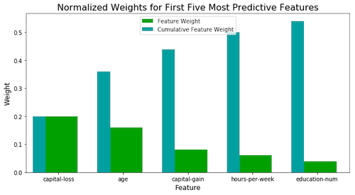

# Disaster Response Pipeline

### About this project:
This project tackles predicting likely donors based on demographic features for the fictitious CharityML organization. Includes a short section for feature exploration, fits multiple candidate models (Random Forest Classifier, Decision Tree, Support Vector Machine, and AdaBoost) and picks the final model based on its f-score before optimizing via GridSearch and making final predictions.

